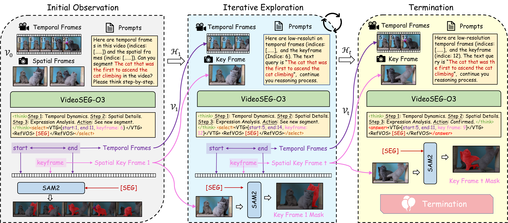

<div align="center">

# VideoSEG-O3: A Multi-turn Reinforcement Learning Framework for Reasoning Video Object Segmentation

**Temporal-spatial reasoning · Multi-turn keyframe exploration · SEG-aware reinforcement learning**

[](#)
[](docs/videoseg-o3.pdf)
[](https://modelscope.cn/models/dmmm997/VideoSEG-O3-2B-RL)
[](https://modelscope.cn/datasets/dmmm997/VideoSEG-O3)

[Ming Dai](https://dmmm1997.github.io/)<sup>1</sup>,
[Sen Yang](https://senyang-ml.github.io/)<sup>2</sup>,
Boqiang Duan<sup>2</sup>,
Boyuan Tong<sup>2</sup>,
Jiedong Zhuang<sup>3</sup>,
[Wankou Yang](https://wkyang.github.io/)<sup>1</sup>,
[Jingdong Wang](https://jingdongwang2017.github.io/)<sup>2</sup>

<sup>1</sup>Southeast University &nbsp;&nbsp;
<sup>2</sup>Baidu Inc. &nbsp;&nbsp;
<sup>3</sup>Zhejiang University

</div>

<p align="center">
  <a href="docs/asserts/model_pipeline.pdf">
    
  </a>
</p>

## 📖 Introduction

**VideoSEG-O3** is a multi-turn reinforcement learning framework for Reasoning
Video Object Segmentation (RVOS). Instead of segmenting from a fixed set of
sampled frames, VideoSEG-O3 actively explores temporal intervals and keyframes
through a temporal-spatial chain-of-thought, enabling coarse-to-fine reasoning
over object identity, motion, and linguistic references. The framework further
introduces SEG-aware logit calibration to connect token-level policy
optimization with pixel-level mask quality, and uses a decoupled thinking trace
to structure temporal, spatial, and language reasoning. The resulting pipeline
combines SFT, VTS-CoT cold start, and GRPO-based reinforcement learning for
multi-turn video segmentation.

## ✨ Highlights

- **Multi-turn temporal-spatial reasoning:** VideoSEG-O3 actively explores temporal intervals and keyframes instead of relying on a fixed frame set.
- **Decoupled thinking trace:** temporal localization, spatial grounding, and language reasoning are structured into an explicit multi-turn workflow.
- **SEG-aware reinforcement learning:** token-level policy optimization is aligned with pixel-level mask quality through dense segmentation rewards.

## 📢 News

- `2026.06.05` 🔥 The [**training code**](docs/TRAIN.md), [**evaluation code**](docs/EVAL.md), and [**paper**](docs/videoseg-o3.pdf) are now available. We have also released the RL checkpoints for [**VideoSEG-O3-2B**](https://modelscope.cn/models/dmmm997/VideoSEG-O3-2B-RL) and [**VideoSEG-O3-4B**](https://modelscope.cn/models/dmmm997/VideoSEG-O3-4B-RL), together with the [**VTS-CoT**](https://modelscope.cn/datasets/dmmm997/VideoSEG-O3) and [**RL training data**](https://modelscope.cn/datasets/dmmm997/VideoSEG-O3).
- `2026.04.30` 🎉 **VideoSEG-O3** has been accepted by [**ICML 2026**](https://icml.cc/Conferences/2026).

## 🏆 Main Results

**Referring Video Object Segmentation (J&F).** VideoSEG-O3 achieves strong performance across five RefVOS benchmarks.

| Model | MeViS | Ref-Youtube-VOS | Ref-DAVIS17 | Ref-SAV | Long-RVOS |
| --- | ---: | ---: | ---: | ---: | ---: |
| VideoSEG-O3-2B | 55.6 | 70.5 | **80.0** | 62.9 | 54.8 |
| VideoSEG-O3-4B | **60.0** | **74.1** | 79.4 | **65.5** | **57.4** |

**Reasoning Video Object Segmentation.** On ReVOS, ReasonVOS, and GroundMoRe, VideoSEG-O3 shows advanced in-domain and zero-shot reasoning performance.

| Model | ReVOS Referring J&F | ReVOS Reasoning J&F | ReVOS Overall J&F | ReasonVOS | GroundMoRe |
| --- | ---: | ---: | ---: | ---: | ---: |
| VideoSEG-O3-2B | 67.5 | 62.0 | 64.8 | 60.2 | 29.1 |
| VideoSEG-O3-4B | **70.3** | **65.1** | **67.7** | **62.9** | **31.9** |


## 🤖 Model Zoo

| Model | Base MLLM | Mask Decoder | SFT | Cold-start | RL |
| --- | --- | --- | --- | --- | --- |
| VideoSEG-O3-2B | [Qwen3-VL-2B-Instruct](https://huggingface.co/Qwen/Qwen3-VL-2B-Instruct) | [SAM2-Hiera-Large](https://dl.fbaipublicfiles.com/segment_anything_2/072824/sam2_hiera_large.pt) | Coming soon | Coming soon | [Checkpoint](https://modelscope.cn/models/dmmm997/VideoSEG-O3-2B-RL) |
| VideoSEG-O3-4B | [Qwen3-VL-4B-Instruct](https://huggingface.co/Qwen/Qwen3-VL-4B-Instruct) | [SAM2-Hiera-Large](https://dl.fbaipublicfiles.com/segment_anything_2/072824/sam2_hiera_large.pt) | Coming soon | Coming soon | [Checkpoint](https://modelscope.cn/models/dmmm997/VideoSEG-O3-4B-RL) |

## 🛠️ Installation

Please follow [**Setup**](docs/SETUP.md) to prepare the environment and pretrained
models.

## 📚 Data Preparation

Please follow [**Data Preparation**](docs/DATA.md) to download the released
VTS-CoT/RL annotations and organize the required original datasets under
`data/`.

## 🚀 Training

VideoSEG-O3 uses SFT, CoT cold-start, and RL stages. Please see
[**Training**](docs/TRAIN.md) for the available configs and launch scripts.

## 📊 Evaluation

Please see [**Evaluation**](docs/EVAL.md) for benchmark evaluation commands and
dataset-specific metric scripts.


## 🙌 Acknowledgements

This project is based on [Sa2VA](https://github.com/magic-research/Sa2VA). We
also thank [Open-R1](https://github.com/huggingface/open-r1) and
[TRL](https://github.com/huggingface/trl) for their open-source reinforcement
learning training frameworks.

## 📮 Contact

If you have any questions, please feel free to open an issue or contact us at
[mingdai@seu.edu.cn](mailto:mingdai@seu.edu.cn). If this project is helpful to
your research, we would appreciate a 🌟.

## 📄 Citation

If you find this project useful, please consider citing:

```bibtex
@inproceedings{dai2026videosego3,
  title     = {VideoSEG-O3: A Multi-turn Reinforcement Learning Framework for Reasoning Video Object Segmentation},
  author    = {Dai, Ming and Yang, Sen and Duan, Boqiang and Tong, Boyuan and Zhuang, Jiedong and Yang, Wankou and Wang, Jingdong},
  booktitle = {ICML},
  year      = {2026}
}
```
